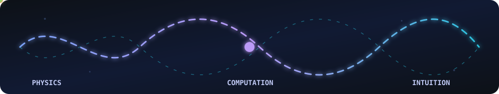

<h1 align="center">
  Hi, I'm Ankit 
</h1>

  <strong>Quantum-assisted scientific machine learning · Computational physics · Scientific visualization</strong>

  

  

  <i>I build computational experiments that make difficult physics observable—and report what they reveal, even when the result is negative.</i>

  
  
  

I'm a physics master's student at **IISER Mohali**. My work focuses on a practical question: how can computation help us test, visualize, and understand physical systems that resist simple intuition?

## Featured Research: QAPINN-CFD

**[QAPINN-CFD](https://github.com/Ankitk108/qapinn-cfd)** is a controlled, multi-seed comparison of classical physics-informed neural networks and quantum-assisted PINNs for the viscous Burgers equation.

| Model | Mean relative L2 | Mean training time | Trainable parameters |
| --- | ---: | ---: | ---: |
| Classical PINN | **0.0214** | **791 s** | 50,049 |
| QAPINN · 4 qubits · depth 2 | 0.4769 | 4,237 s | **41** |
| QAPINN · 4 qubits · depth 4 | 0.4376 | 7,629 s | **65** |

**Finding:** the hybrid models achieved dramatic parameter reduction, but not better accuracy or wall-clock performance on PennyLane's analytic simulator. Greater circuit depth modestly improved hybrid accuracy while increasing runtime and memory. The evidence supports parameter efficiency—not quantum advantage.

  <a href="https://github.com/Ankitk108/qapinn-cfd/blob/master/report/final_report.md"><strong>Read the report</strong></a>
  ·
  <a href="https://github.com/Ankitk108/qapinn-cfd"><strong>Explore the code</strong></a>

  

The framework uses matched sampling and loss definitions, end-to-end second-order automatic differentiation, fixed seeds, configuration-locked runs, diagnostic plots, and explicit accuracy gates. Failed or incomplete configurations remain visible rather than being filtered out after evaluation.

## Selected Computational Work

### Real-Space Topological Invariants

**[Real-Space Topological Invariants Visualization Suite](https://github.com/Ankitk108/real-space-topology-suite)** computes the Bott index and spectral localizer for finite topological systems without relying on momentum-space or Bloch-wave methods. It is designed for disorder, open boundaries, and broken translational symmetry.

[**Source code →**](https://github.com/Ankitk108/real-space-topology-suite) · [**Interactive demo →**](https://ankitk108.github.io/real-space-topology-suite/)

### Interactive Physics Tools

| Project | What becomes observable | Try it |
| --- | --- | --- |
| [Quantum State Visualizer](https://github.com/Ankitk108/Quantum-State-Visualizer) | Qubit states, gates, amplitudes, probabilities, and Bloch-sphere geometry | [Live demo](https://ankitk108.github.io/Quantum-State-Visualizer/) |
| [Quantum Channel Visualization](https://github.com/Ankitk108/Quantum-Channel-Visualization) | How bit-flip, phase-flip, and depolarizing noise deform the Bloch sphere | [Live demo](https://ankitk108.github.io/Quantum-Channel-Visualization/) |
| [Vicsek Model Simulation](https://github.com/Ankitk108/Vicsek-Model-Simulation) | Collective motion and noise-driven ordering in active-particle systems | [Live demo](https://ankitk108.github.io/Vicsek-Model-Simulation/) |

### Community Software

**[VectorHue](https://github.com/Ankitk108/VectorHue)** is a browser-based design utility for IISER Mohali student clubs. It provides structure-aware asset editing, reusable presets, and high-resolution transparent exports. [Try the live app →](https://ankitk108.github.io/VectorHue/)

## Technical Focus

| Area | Tools | Applied to |
| --- | --- | --- |
| **Scientific ML & quantum** | Python, PyTorch, NumPy, SciPy, PennyLane, Qiskit | PINNs, PDEs, variational circuits, automatic differentiation, numerical experiments |
| **Scientific visualization** | JavaScript, Three.js, Plotly.js, Canvas, HTML/CSS | Interactive quantum, topology, and collective-dynamics tools |
| **Reproducible research** | Git, Linux, Jupyter, pytest, YAML | Multi-seed studies, configuration-locked runs, validation, and traceable results |

## Beyond the Code

- 🥇 **1st place, Bets & Bytes — Insomnia'24 Hackathon**, building autonomous poker bots
- 🌐 **Lead Developer and former Convener, Curie Club at IISER Mohali**, developing its website and automating event and attendance workflows

## Public Activity

  

<picture>
  <source media="(prefers-color-scheme: dark)" srcset="https://raw.githubusercontent.com/Ankitk108/Ankitk108/output/github-contribution-grid-snake-dark.svg" />
  <source media="(prefers-color-scheme: light)" srcset="https://raw.githubusercontent.com/Ankitk108/Ankitk108/output/github-contribution-grid-snake.svg" />
  
</picture>

## Contact

I welcome conversations about quantum computing, scientific machine learning, computational physics, and research software. **[Email me](mailto:ankitkash2002@gmail.com)** or connect with me on **[LinkedIn](https://www.linkedin.com/in/ankit-kashyap-368a78257)**.
